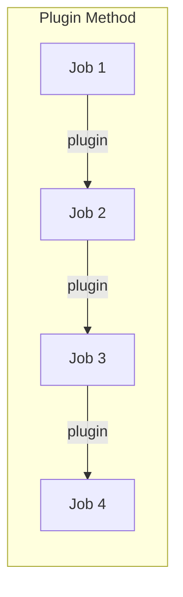
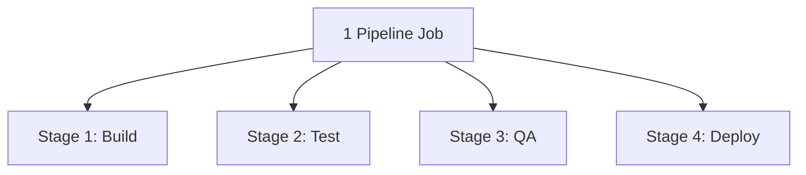
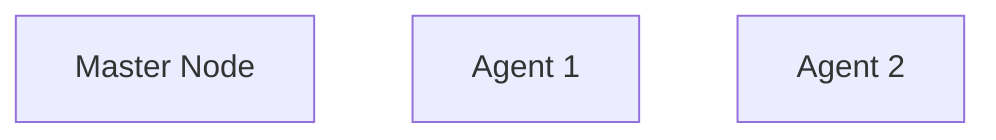
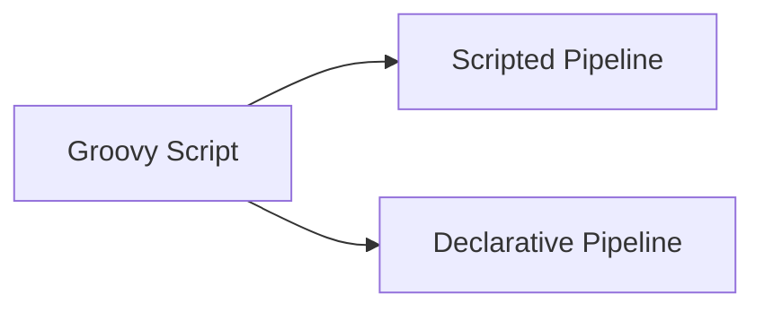

# 🔧 Jenkins Pipeline — Plugins Method vs Groovy Script Method

> Simple, easy-language notes on how Jenkins Pipelines are built, why Groovy Script is preferred in the industry, and the difference between Scripted and Declarative Pipeline syntax.

---

## 📌 Quick Recap

Jab hum multiple jobs ko aapas mein connect karte hain (jaise Build → Test → QA → Deploy), toh ek **Pipeline** ban jaata hai.


Pipeline banane ke **2 methods** available hain:

| Method | Kaise Banta Hai |
|---|---|
| 🔌 **Plugins Method** | Multiple separate jobs banao, plugins se aapas mein integrate karo |
| 📝 **Groovy Script Method** | Ek hi job banao, uske andar "stages" mein pura kaam divide karo |

---

## 🔌 Method 1 — Plugins Ke Through Pipeline

Yeh wahi tarika hai jo humne pehle projects mein use kiya tha:

1. Job 1 banaya (Build)
2. Job 2 banaya (Test)
3. Job 3 banaya (QA)
4. Job 4 banaya (Deploy)
5. "Build after other projects are built" plugin se sabko chain mein jod diya



### ❌ Isme Problem Kya Hai?

Real company mein kaam bahut complex hota hai. Agar har chhote task ko separate job banate jao:

> Job 1 mein 20 tasks, Job 2 mein 15, Job 3 mein 10, Job 4 mein 40 tasks...

Aur management bole "har task ko separate karo" — toh:

- 4 jobs se seedha **40, 60, 100, 200+ jobs** ban jaati hain
- Itni saari jobs ko aapas mein integrate karna aur manage karna **bahut mushkil** ho jaata hai

> 💡 Yehi wajah hai Jenkins documentation mein likha hota hai:
> *"Organizing complex activities that do not easily fit in a Freestyle project type"* — matlab complex kaam ke liye Freestyle/Plugin method fit nahi baithta.

---

## 📝 Method 2 — Groovy Script Ke Through Pipeline

Isi problem ko solve karta hai **Groovy Script**.

### ✅ Sabse Bada Fayda

> Chahe 200 tasks ho, **sirf 1 job banani padti hai** (jisko "Pipeline" job type kehte hain). Tasks ko separate karne ke liye jobs nahi, **"Stages"** use hote hain.



Isiliye ise **"Jenkins Pipeline"** bhi bola jaata hai.

---

## 🏆 Groovy Script Ke 6 Bade Fayde (Interview Ke Liye Important!)

<details>
<summary><b>1️⃣ Ek Hi Job, Multiple Stages — Management Aasan</b></summary>

<br>

Plugin method mein 200 tasks ke liye 200 jobs banani padti. Groovy Script mein 1 job ke andar 200 stages likh sakte ho. Manage karna bahut easy ho jaata hai.

</details>

<details>
<summary><b>2️⃣ Local System Se Kaam — Baar-Baar Jenkins UI Nahi Kholna Padta</b></summary>

<br>

- Pehli baar job banane ke liye Jenkins UI (User Interface) access karna padta hai — chahe Plugin method ho ya Groovy Script
- Lekin **doosri baar se**:
  - **Plugin method**: har chhota change karne ke liye phir se Jenkins UI mein jaana padta hai
  - **Groovy Script method**: apne local laptop/system mein text file mein script likh ke, GitHub par push kar sakte ho. GitHub already Jenkins job se linked hai, toh changes automatically reflect ho jaate hain — UI mein jaane ki zaroorat nahi

</details>

<details>
<summary><b>3️⃣ Skip Option — Kisi Stage Ko Temporarily Skip Kar Sakte Ho</b></summary>

<br>

Maan lo pipeline mein 4 stages hain aur aap chahte ho **Stage 3 ko temporarily skip** kar do (delete nahi karna, bas skip karna).

- **Plugin method**: Yeh possible nahi. Agar job nahi chalani toh use pipeline se hataana hi padega
- **Groovy Script method**: Stage ka code wahi rahega, bas "skip" kar sakte ho — jab chaho wapas enable kar do

</details>

<details>
<summary><b>4️⃣ Restart Specific Stage — Pura Pipeline Dobara Nahi Chalana Padta</b></summary>

<br>

Yeh sabse **important benefit** hai:

- Maan lo Stage 1 = 10 min, Stage 2 = 20 min, Stage 3 = 30 min leta hai
- Agar Stage 3 mein error aaya:
  - **Plugin method**: Pura pipeline (Job 1 → 2 → 3 → 4) **dobara se** chalana padega = 1 hour extra waste
  - **Groovy Script method**: Sirf **Stage 3 ko restart** kar sakte ho — Stage 1 aur 2 ko dobara chalane ki zaroorat nahi

> ⏱️ Company mein time bachana hi paisa bachana hai — isliye yeh feature bahut valuable hai.

</details>

<details>
<summary><b>5️⃣ Load Distribution — Kaam Ko Multiple Agents Mein Baant Sakte Ho</b></summary>

<br>

Jenkins setup mein ek **Master** node hota hai aur kuch **Agent** nodes (backup/helper servers).



- **Plugin method**: Sab kaam hamesha Master node par hi chalta hai. Agents tabhi use hote hain jab Master down ho jaaye (jo rarely hota hai) — matlab agents zyada tar khaali baithe rehte hain
- **Groovy Script method**: Aap khud decide kar sakte ho ki Stage 1 Master pe chale, Stage 2 Agent 1 pe chale, Stage 3 Agent 2 pe chale — **load distribute** ho jaata hai, Master par pressure kam hota hai

</details>

<details>
<summary><b>6️⃣ Loop & Condition Support</b></summary>

<br>

Groovy Script mein aap conditions aur loops laga sakte ho, jaise:

> "Stage 3 tabhi chale jab Jenkins server ka RAM 4GB ho"

Yeh functionality Plugin/Freestyle method mein available nahi hai.

</details>

---

### 🤔 "Toh Kya Groovy Script Mein Plugins Ki Zaroorat Nahi Padti?"

**Common Interview Trap Question!** ⚠️

> Answer: Plugins ki zaroorat **padti hai**, lekin Groovy Script mein zyada tar plugins (~80%) **automatically** install ho jaate hain jab aap Groovy Script se job banate ho. Kuch major plugins aapko manually add karne padte hain — baaki khud-ba-khud aa jaate hain.

---

## 🆚 Plugin Method vs Groovy Script — Summary Table

| Point | Plugin Method | Groovy Script Method |
|---|---|---|
| Jobs needed for 200 tasks | 200 separate jobs | 1 job, 200 stages |
| Managing complexity | Bahut mushkil | Aasan |
| Change karne ke liye | Har baar Jenkins UI chahiye | Local system se hi ho jaata hai |
| Skip stage | ❌ Possible nahi | ✅ Possible |
| Restart specific stage | ❌ Pura pipeline dobara chalana padta hai | ✅ Sirf woh stage restart hoti hai |
| Load distribution (Master/Agents) | ❌ Sirf Master pe chalta hai | ✅ Agents mein distribute kar sakte ho |
| Loop/Condition support | ❌ Nahi | ✅ Haan |
| Industry preference | Kam use hota hai | ✅ Zyada use hota hai |

---

## 📐 Groovy Script Ke Andar 2 Types

Groovy Script se pipeline likhne ke bhi 2 tarike hote hain:



> Scripted pehle aaya tha, uske baad Declarative aaya — jisme zyada functionality hai. Isliye **industry mein zyada Declarative use hota hai.**

---

### 🧩 Scripted Pipeline — Syntax

```groovy
node {
    stage('Build') {
        echo 'Welcome to Build Stage'
    }
    stage('Test') {
        echo 'Welcome to Test Stage'
    }
    stage('QA') {
        echo 'Welcome to QA Stage'
    }
    stage('Deploy') {
        echo 'Welcome to Deploy Stage'
    }
}
```

**Kaise samjhein:**
- Sab kuch `node { ... }` ke andar likha jaata hai
- Har `stage('naam') { ... }` ek task/step represent karta hai
- Curly brackets `{ }` ka dhyan rakhna zaroori hai — kaunsa bracket kisko close kar raha hai

---

### 🧩 Declarative Pipeline — Syntax

```groovy
pipeline {
    agent any

    stages {
        stage('Build') {
            steps {
                echo 'Welcome to Build Stage'
            }
        }
        stage('Test') {
            steps {
                echo 'Welcome to Test Stage'
            }
        }
    }
}
```

**Kaise samjhein:**
- Shuru hota hai `pipeline { }` keyword se
- `agent any` — matlab jo bhi agent (Master/Agent 1/Agent 2) available ho, wahi is stage ko run kar de
- Uske andar `stages { }` block, jisme multiple `stage('naam') { }` hote hain
- Har stage ke andar `steps { }` block hota hai, jisme actual tasks/commands likhe jaate hain

**Structure Hierarchy:**
```
pipeline
 └── stages
      └── stage
           └── steps
                └── task/command
```

---

## ⚖️ Scripted vs Declarative — Sabse Important Difference

Yeh **interview mein sabse zyada poocha jaane wala** point hai:

| Scripted Pipeline | Declarative Pipeline |
|---|---|
| Agar ek stage ka syntax galat hai, baaki saari sahi stages **chal jaati hain**, sirf galat wali nahi chalti | Agar **kisi ek bhi stage** ka syntax galat hai, **poora pipeline hi nahi chalega** |
| Result: aapko pata nahi chalta turant, partial output milta hai jo useful nahi hota | Result: Jenkins shuru mein hi error bata deta hai — syntax check pehle hota hai |
| Kam functionality | Zyada functionality (loop, condition, restart, skip — sab better support karta hai) |
| Purana concept | Modern, zyada use hota hai |

> 💡 Declarative Pipeline pehle **poora syntax check** karta hai — agar kahin bhi mistake hai, pipeline start hi nahi hota. Isse time waste nahi hota aur galti turant pata chal jaati hai.

---

## 🎯 Quick Self-Check Quiz

<details>
<summary>Q1: Agar 200 tasks hain toh Plugin method mein kitni jobs banani padengi?</summary>

<br>**Answer:** 200 alag-alag jobs (bahut mushkil manage karna)
</details>

<details>
<summary>Q2: Groovy Script mein 200 tasks ke liye kitni jobs chahiye?</summary>

<br>**Answer:** Sirf 1 job — 200 stages usi ek pipeline job ke andar define honge
</details>

<details>
<summary>Q3: Agar Stage 3 mein error aaye, Plugin method mein kya karna padega?</summary>

<br>**Answer:** Pura pipeline (sabhi jobs) dobara se chalana padega — time waste hota hai
</details>

<details>
<summary>Q4: Groovy Script mein Stage 3 mein error aaye toh?</summary>

<br>**Answer:** Sirf Stage 3 ko restart kar sakte hain, baaki stages dobara chalane ki zaroorat nahi
</details>

<details>
<summary>Q5: Scripted aur Declarative Pipeline mein sabse bada difference kya hai?</summary>

<br>**Answer:** Scripted mein ek stage galat ho toh baaki sahi stages chal jaati hain. Declarative mein agar ek bhi stage ka syntax galat hai, toh poora pipeline hi nahi chalta.
</details>

<details>
<summary>Q6: Kya Groovy Script mein plugins ki zaroorat nahi padti?</summary>

<br>**Answer:** Padti hai, lekin zyada tar (~80%) plugins automatically install ho jaate hain. Kuch major plugins manually add karne padte hain.
</details>

---

## 💼 Interview Ke Liye Ready Summary (English)

> "Jenkins pipelines can be built in two ways — using plugins (multiple separate jobs chained together) or using Groovy Script (a single pipeline job divided into stages). The plugin method becomes very hard to manage as the number of tasks grows, since each task needs its own job. Groovy Script solves this by letting you define hundreds of tasks as 'stages' inside just one job. It also offers major advantages: you can edit the pipeline from your local system without repeatedly accessing the Jenkins UI, skip a stage without deleting it, restart just one failed stage instead of the whole pipeline, distribute load across multiple Jenkins agents, and use loops/conditions. Within Groovy Script, there are two syntaxes — Scripted and Declarative. Declarative is more modern and widely used because it validates the entire pipeline syntax before running, so a mistake in one stage stops the whole pipeline early instead of producing a partial, unreliable result."

---

## 📚 Next Topics

- ✅ Scripted Pipeline — Practical Project
- ✅ Declarative Pipeline — Practical Project

---

*Notes prepared from Jenkins Module 15 (Part 2) — Pipeline Concepts.*
