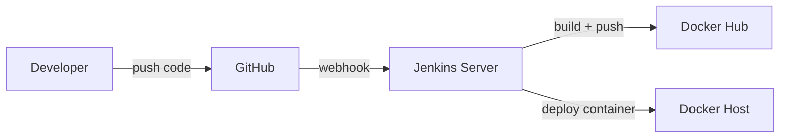
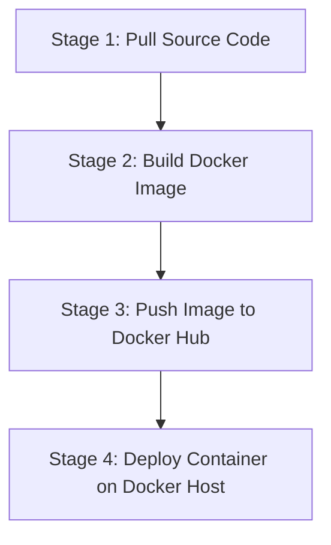

# 🚀 Jenkins Scripted Pipeline — Practical Project Notes

> Ek real project banate hue Scripted Pipeline (Groovy Script) seekhte hain — GitHub se code pull karna, Docker image build karna, Docker Hub par push karna, aur Docker Host par container deploy karna — sab kuch **ek hi Jenkins Pipeline job** ke andar, multiple stages mein.

---

## ✅ Prerequisites (Yeh Aana Chahiye Pehle Se)

- [ ] Jenkins ki basic 10 videos/concepts already dekhe hon
- [ ] Pichla video (Groovy Script theory — Plugins vs Groovy) dekha ho
- [ ] Docker ki knowledge
- [ ] Kubernetes ki basic knowledge
- [ ] AWS ki knowledge
- [ ] Linux ki knowledge

> 💡 Isiliye kaha jaata hai — **Jenkins ko sabse last mein padhna chahiye**, jab baaki DevOps tools (Linux, Docker, K8s, AWS, Ansible) already aa chuke hon.

---

## 🖥️ Setup — Kitne Servers Chahiye?



| Server | Role | Pre-installed? |
|---|---|---|
| **Jenkins Server** | Job/Pipeline run karega | ✅ Jenkins already installed |
| **Docker Host** | Container yahan deploy hoga | ❌ Docker abhi install nahi (practical mein karenge) |

> Minimum 2 servers chahiye (max 3-4 bhi rakh sakte ho). AWS, Azure, GCP, ya kisi bhi VM par chalega — koi farak nahi padta.

---

## 📝 Step 1 — Pipeline Job Create Karna

1. Jenkins → **New Item**
2. Naam do: `Scripted-Pipeline-Demo`
3. Type select karo: **Pipeline** (Freestyle nahi!)
4. **OK**

### Job Type Pehchanne Ka Trick

| Option Jo Dikhta Hai | Matlab |
|---|---|
| **Pipeline script** | Aap **Scripted Pipeline** likhne jaa rahe ho |
| **Pipeline script from SCM** | Aap **Declarative Pipeline** (Git se) banane jaa rahe ho |

Is project mein hum **"Pipeline script"** option choose karenge, kyunki abhi Scripted Pipeline seekh rahe hain.

---

## 🧩 Full Script Structure (Overview)

Poora pipeline **4 stages** mein bant'a hai:



---

## 🔨 Stage 1 — Pull Source Code From GitHub

```groovy
node {
    stage('Pull Source Code') {
        git 'https://github.com/<your-username>/<your-repo>.git'
    }
}
```

**Kaise likhein agar syntax yaad na ho?**
1. Job → **Pipeline Syntax** (left menu) pe jao
2. Sample Step mein `git: Git` choose karo
3. Apna GitHub repo URL paste karo
4. **Generate Pipeline Script** click karo — poora sahi syntax mil jayega

<details>
<summary>⚠️ Error jo aa sakta hai: <code>git: command not found</code></summary>

<br>

**Reason:** Jenkins server par Git ka package install nahi hai.

**Fix:**
```bash
yum install git -y
```
</details>

---

## 🔨 Stage 2 — Build Docker Image (With Versioning)

```groovy
stage('Build Docker Image') {
    sh 'docker image build -t $JOB_NAME:V1.$BUILD_ID .'
    sh 'docker image tag $JOB_NAME:V1.$BUILD_ID sd171991/$JOB_NAME:V1.$BUILD_ID'
    sh 'docker image tag $JOB_NAME:V1.$BUILD_ID sd171991/$JOB_NAME:latest'
}
```

> 📌 Har shell command ke aage `sh` keyword lagana zaroori hai — yeh batata hai ki yeh ek **shell command** hai.

**Yahan kya ho raha hai:**
- `$JOB_NAME` aur `$BUILD_ID` — Jenkins ke predefined variables (job ka naam + auto-incrementing build number)
- Ek version tag (`V1.1`, `V1.2`...) aur ek `latest` tag — dono set kiye taaki image ki versioning maintain rahe

<details>
<summary>⚠️ Error: <code>docker: command not found</code></summary>

<br>

**Reason:** Jenkins server par Docker install nahi hai.

**Fix:**
```bash
yum install docker -y
systemctl start docker
```
</details>

<details>
<summary>⚠️ Error: <code>Permission denied</code></summary>

<br>

**Reason:** Jenkins service jis `jenkins` user se chalti hai, usko Docker execution file par permission nahi hai.

**Fix (koi ek karo):**
```bash
# Option 1: Jenkins user ko ownership do
chown jenkins:jenkins /var/run/docker.sock

# Option 2: Full permission de do (jaldi wala tarika)
chmod 777 /var/run/docker.sock
```
</details>

---

## 🔨 Stage 3 — Push Image to Docker Hub + Cleanup

### Password Ko Secure Rakhna (Credentials)

Docker Hub password seedha script mein likhna **galat practice** hai (sabko dikh jayega). Iske liye Jenkins Credentials use karo:

1. Jenkins → **Manage Jenkins → Credentials**
2. **Add Credentials → Secret text**
3. Secret: apna Docker Hub password
4. ID: `dockerHubPassword` (koi bhi naam)
5. **Pipeline Syntax** mein jaake is credential ka syntax generate karo

```groovy
stage('Push Image to Docker Hub') {
    withCredentials([string(credentialsId: 'dockerHubPassword', variable: 'dockerHubPassword')]) {
        sh 'docker login -u sd171991 -p ${dockerHubPassword}'
    }
    sh 'docker image push sd171991/$JOB_NAME:V1.$BUILD_ID'
    sh 'docker image push sd171991/$JOB_NAME:latest'

    // Local server pe images accumulate na ho, isliye delete kar do
    sh 'docker image rmi $JOB_NAME:V1.$BUILD_ID sd171991/$JOB_NAME:V1.$BUILD_ID sd171991/$JOB_NAME:latest'
}
```

> 💡 **Kyun cleanup zaroori hai?** Har baar job chalne par naya image build hoga. Agar delete na karein, toh Jenkins server par images ka dher lag jayega aur disk space bharta rahega.

---

## 🔨 Stage 4 — Deploy Container on Docker Host (Remote Machine)

Yeh sabse tricky stage hai kyunki container **Jenkins server par nahi**, balki ek **alag remote machine (Docker Host)** par deploy karna hai.

### Extra Plugin Chahiye: SSH Agent

> Groovy Script mein 80% plugins automatically aa jaate hain, lekin kuch (jaise SSH Agent) manually install karne padte hain.

**Manage Jenkins → Manage Plugins → Available → search "SSH Agent" → Install**

### Credentials Set Karna (Docker Host Access Ke Liye)

1. **Add Credentials → SSH Username with private key**
2. Username: `ec2-user` (ya `root`)
3. Private Key: apni AWS `.pem` key ka content
4. ID: `docker-host-key`

### Script

```groovy
stage('Deployment of Docker Container') {
    sshagent(['docker-host-key']) {
        def dockerRm = "docker container rm -f cloudknowledge"
        def dockerRun = "docker run -p 80:80 -itd --name cloudknowledge sd171991/\$JOB_NAME:latest"
        sh "ssh -o StrictHostKeyChecking=no ec2-user@<Docker-Host-Private-IP> '${dockerRm} ; ${dockerRun}'"
    }
}
```

**Important cheezein:**
- `def variableName = "command"` — variable define karne ka Groovy syntax
- `-o StrictHostKeyChecking=no` — host key verification skip karta hai (pehli baar SSH karne par prompt nahi aata)
- **Purana container pehle remove karna zaroori hai**, warna "container already exists" wala error aayega dobara run karne par

<details>
<summary>⚠️ Error: <code>docker: command not found</code> (Docker Host par)</summary>

<br>

**Reason:** Docker Host par abhi tak Docker install nahi hai.

**Fix (Docker Host par):**
```bash
yum install docker -y
systemctl start docker
```
</details>

<details>
<summary>⚠️ Error: <code>Container "cloudknowledge" already exists</code></summary>

<br>

**Reason:** Pehli baar container ban chuka hai. Dusri baar same naam se banane ki koshish ho rahi hai.

**Fix:** Container create karne se **pehle** ek "remove" command daalo (jaisa upar script mein already hai — `docker container rm -f cloudknowledge` pehle chalta hai, phir naya container banta hai).

> ⚠️ Order maintain karna zaroori hai: pehle **remove**, fir **run** — ulta order karne se purana error dobara aayega.
</details>

---

## ⚠️ Ek Important Limitation (Interview Mein Poocha Ja Sakta Hai)

Is scripted pipeline mein **ek chhoti si khaamiyan (gap)** hai:

> Jab dusri baar Dockerfile mein change karke job chalayi, toh naya container to bana, lekin **content update nahi hua**. Reason: Docker Host par pehle se woh `latest` image local mein pehle se maujood thi. Docker pehle **local** mein image dhoondta hai — agar mil jaye, toh Hub se dobara **pull hi nahi karta**, chahe Hub par updated `latest` image ho.

**Solution kya hoga?** — Container ke saath-saath **local image ko bhi remove** karna padega Docker Host par, taaki wo force se Hub se naya pull kare. (Yeh cheez Declarative Pipeline wale practical mein aur behtar tarike se solve ki jayegi.)

---

## 🌐 Auto-Trigger Setup (Webhook)

Manual "Build Now" click karne ke bajaye, jab bhi developer commit kare tab automatically job chale:

1. Jenkins job → **Configure → Build Triggers**
2. Check karo: ✅ **GitHub hook trigger for GITScm polling**
3. GitHub repo → **Settings → Webhooks → Add webhook**
   - Payload URL: `http://<Jenkins-Public-IP>:8080/github-webhook/`
   - Content type: `application/json`
   - Secret: Jenkins token (Configure → Add Token se generate karo)
4. **Add webhook**

> ⚠️ Dono settings zaroori hain — sirf webhook add karna kaafi nahi, job ke andar **"GitHub hook trigger"** bhi enable karna padega, warna commit hone par bhi job trigger nahi hogi.

---

## 📜 Complete Script (Sab Stages Combined)

```groovy
node {
    stage('Pull Source Code') {
        git 'https://github.com/<your-username>/<your-repo>.git'
    }

    stage('Build Docker Image') {
        sh 'docker image build -t $JOB_NAME:V1.$BUILD_ID .'
        sh 'docker image tag $JOB_NAME:V1.$BUILD_ID sd171991/$JOB_NAME:V1.$BUILD_ID'
        sh 'docker image tag $JOB_NAME:V1.$BUILD_ID sd171991/$JOB_NAME:latest'
    }

    stage('Push Image to Docker Hub') {
        withCredentials([string(credentialsId: 'dockerHubPassword', variable: 'dockerHubPassword')]) {
            sh 'docker login -u sd171991 -p ${dockerHubPassword}'
        }
        sh 'docker image push sd171991/$JOB_NAME:V1.$BUILD_ID'
        sh 'docker image push sd171991/$JOB_NAME:latest'
        sh 'docker image rmi $JOB_NAME:V1.$BUILD_ID sd171991/$JOB_NAME:V1.$BUILD_ID sd171991/$JOB_NAME:latest'
    }

    stage('Deployment of Docker Container') {
        sshagent(['docker-host-key']) {
            def dockerRm = "docker container rm -f cloudknowledge"
            def dockerRun = "docker run -p 80:80 -itd --name cloudknowledge sd171991/\$JOB_NAME:latest"
            sh "ssh -o StrictHostKeyChecking=no ec2-user@<Docker-Host-Private-IP> '${dockerRm} ; ${dockerRun}'"
        }
    }
}
```

---

## 🐛 Troubleshooting Cheat Sheet

| Error Message | Kahan Aata Hai | Fix |
|---|---|---|
| `git: command not found` | Jenkins Server | `yum install git -y` |
| `docker: command not found` | Jenkins Server / Docker Host | `yum install docker -y` + `systemctl start docker` |
| `Permission denied` (docker.sock) | Jenkins Server | `chmod 777 /var/run/docker.sock` ya ownership do |
| `Container already exists` | Docker Host | Create se pehle `docker container rm -f <name>` chalao |
| Content update nahi ho raha | Docker Host | Local image bhi remove karo, sirf container kaafi nahi |
| Job auto-trigger nahi ho rahi | Jenkins | "GitHub hook trigger" checkbox enable karo Build Triggers mein |

---

## 🎯 Key Takeaways

- ✅ Poora pipeline **ek hi job** ke andar bana — sirf 4 stages use kiye
- ✅ Har stage ka **graphical view + logs** UI mein hi milte hain — alag "console output" mein jaane ki zaroorat nahi
- ✅ `$JOB_NAME` / `$BUILD_ID` variables se **automatic versioning**
- ✅ Passwords **Credentials Manager** mein secure rakhe, code mein nahi
- ✅ Remote server (Docker Host) par deploy karne ke liye **SSH Agent plugin** chahiye
- ⚠️ Local image cache ki wajah se "latest" update na hone wali limitation — Declarative Pipeline mein better solve hogi

---

## 💼 Interview Ready Summary

> "I built a Scripted Pipeline in Jenkins using Groovy Script, structured into four stages inside a single job: pulling source code from GitHub, building a Docker image with version and latest tags, pushing it to Docker Hub using securely stored credentials, and finally deploying it as a container on a separate remote Docker Host using the SSH Agent plugin. I handled common real-world issues like missing packages, Docker permission errors, and container name conflicts by adding a 'remove before create' step in the deployment stage."

---

## 📚 Next Up

- ✅ Declarative Pipeline — Practical Project (better handles the "old image not updating" issue)
- 🔍 One more Scripted vs Declarative difference (heavily asked in interviews) — covered after Declarative practical

---

*Notes prepared from Jenkins Module 15 (Part 3) — Scripted Pipeline Practical.*
